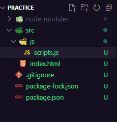
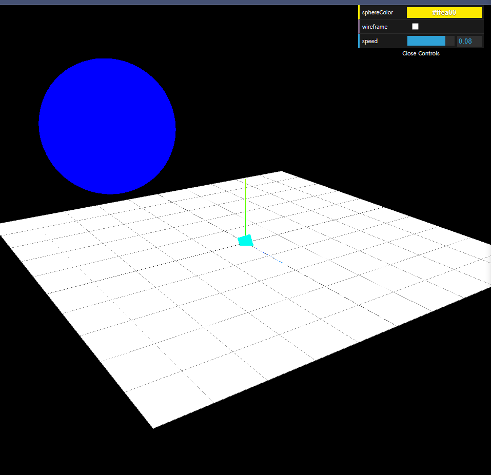

[Three.js Tutorial For Absolute Beginners](https://www.youtube.com/watch?v=xJAfLdUgdc4&list=PLjcjAqAnHd1EIxV4FSZIiJZvsdrBc1Xho&index=1&t=2758s)

[3D model import하는 방법(별도 영상)](https://www.youtube.com/watch?v=xJAfLdUgdc4&list=PLjcjAqAnHd1EIxV4FSZIiJZvsdrBc1Xho&index=1&t=2758s)

# 1. 세팅

## 1-1. bundler(parcel) 설치 후 index.html 생성

```bash
npm install parcel --save-dev
```



## 1-2. three.js 설치

```bash
npm install three
```


## 1-3. automatic refresh 적용

```bash
parcel ./src/index.html
```


# 2. 구성 요소

## 2-1. Camera

### 2-1-1. Perspective Camera

현실 세계의 카메라와 같다. 개체가 카메라와 가까워지면 커지고, 멀어지면 작아진다.

### 2-1-2. Orthographic(정사영) Camera

카메라가 볼 수 잇는 상 하 좌 우의 범위가 정해져 있다. 개체가 카메라와 가깝든 멀든 크기는 똑같다.


# 3. 정육면체와 구 렌더링하고 이동시키기



```javascript
import * as THREE from 'three';
import { OrbitControls } from 'three/examples/jsm/controls/OrbitControls.js';
import * as dat from 'dat.gui';

const renderer = new THREE.WebGLRenderer();
renderer.setSize(window.innerWidth, window.innerHeight);
// 캔버스
document.body.appendChild(renderer.domElement);

const scene = new THREE.Scene();

const camera = new THREE.PerspectiveCamera(
  45,
  window.innerWidth / window.innerHeight,
  // 카메라 범위
  0.1,
  1000
);

// 카메라 조작
const orbit = new OrbitControls(camera, renderer.domElement);

// 좌표축 표시 (x: 빨강, y: 초록, z: 파랑)
const axeshelper = new THREE.AxesHelper(5);
scene.add(axeshelper);

// 카메라 위치
camera.position.set(-10, 30, 30);
orbit.update()

// 박스 개체
const boxGeometry = new THREE.BoxGeometry();
const boxMaterial = new THREE.MeshBasicMaterial({ color: 0x00FFF0 });
const box = new THREE.Mesh(boxGeometry, boxMaterial);
scene.add(box);

// 평면 개체
const planeGeometry = new THREE.PlaneGeometry(30, 30);
const planeMaterial = new THREE.MeshBasicMaterial({ color: 0xFFFFFF, side: THREE.DoubleSide });
const plane = new THREE.Mesh(planeGeometry, planeMaterial);
scene.add(plane);
plane.rotation.x = -0.5 * Math.PI;

// 평면 위치
const gridHelper = new THREE.GridHelper(30);
scene.add(gridHelper);

// 구 개체
const sphereGeometry = new THREE.SphereGeometry(4, 50, 50);
const sphereMaterial = new THREE.MeshBasicMaterial({ color: 0x0000FF, wireframe: false });
const sphere = new THREE.Mesh(sphereGeometry, sphereMaterial);
scene.add(sphere);

sphere.position.set(-10, 10, 0);

const gui = new dat.GUI();
const options = {
  sphereColor: '#FFEA00',
  wireframe: false,
  speed: 0.01
}

gui.addColor(options, 'sphereColor').onChange(function (e) {
  sphere.material.color.set(e);
});

gui.add(options, 'wireframe').onChange(function (e) {
  sphere.material.wireframe = e;
});

gui.add(options, 'speed', 0, 0.1);

let step = 0;


// 자동으로 돌아가는 애니메이션
function animate(time) {
  box.rotation.x = time / 1000;
  box.rotation.y = time / 1000;

  step += options.speed;
  sphere.position.y = 10 * Math.abs(Math.sin(step));
  renderer.render(scene, camera);
}

renderer.setAnimationLoop(animate);
```


# 4. Light


